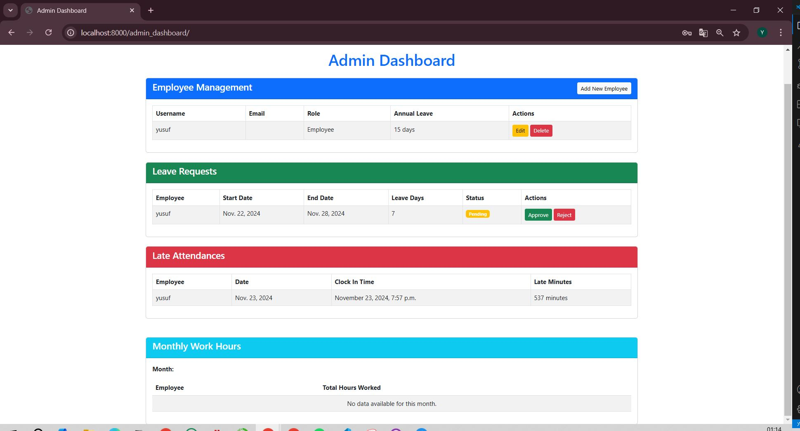
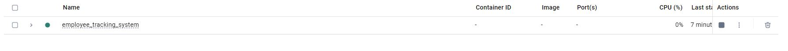

# Employee Tracking System - Setup & Usage Guide

## Prerequisites
- Docker Desktop installed and running in the background.
- Docker Compose installed on your machine.
- Terminal or Command Prompt access.

## Step-by-Step Instructions

### 1. Run Docker Compose
In your terminal, navigate to the project directory and run the following command to build and start the services:

docker-compose up --build

This will start all the necessary containers, including the application service, database, and any other dependencies defined in the `docker-compose.yml` file.

### 2. Access the Docker Container
Once the Docker containers are up and running, access the terminal of the running web container (`employee_tracking_system-web-1`) by using the following command:

docker exec -it employee_tracking_system-web-1 /bin/bash

This will open a shell session inside the web container.

### 3. Run Migrations
Inside the container, navigate to the project directory (if necessary) and apply the database migrations:

python manage.py migrate

This will ensure the database is up-to-date with the latest schema changes.

### 4. Create a Superuser
To create a superuser for the Django Admin panel, run the following command:

python manage.py createsuperuser

You will be prompted to enter a username, email, and password for the superuser account.

### 5. Login to the Admin Panel
After successfully creating the superuser, you can access the Django Admin panel by visiting the following URL in your browser:

http://localhost:8000/admin/

Log in using the superuser credentials you just created.

### 6. Change User Permissions
Once logged in to the Django Admin panel:

- Navigate to the **Users** section.
- Find the user you want to modify.
- Edit the user and change their role/permissions to Admin by checking the **“Staff status”** and **“Superuser status”** options.

### 7. Normal Login
Once the user has been granted admin permissions, they will have full access to the admin panel and other features of the application. You can also perform a normal login by navigating to the login page.

### 8. Access Swagger UI
To access the Swagger UI for API documentation, go to the following URL:

http://localhost:8000/swagger/

## Troubleshooting

- **Docker Not Running:** Make sure Docker Desktop is running in the background.
- **Permission Issues:** Ensure that your user has the necessary permissions to run Docker and Docker Compose commands.

***********************************************************************************************************************************************************************************************************************

***********************************************************************************************************************************************************************************************************************
3
***********************************************************************************************************************************************************************************************************************

***********************************************************************************************************************************************************************************************************************

***********************************************************************************************************************************************************************************************************************

***********************************************************************************************************************************************************************************************************************

***********************************************************************************************************************************************************************************************************************

***********************************************************************************************************************************************************************************************************************

***********************************************************************************************************************************************************************************************************************

***********************************************************************************************************************************************************************************************************************

***********************************************************************************************************************************************************************************************************************
